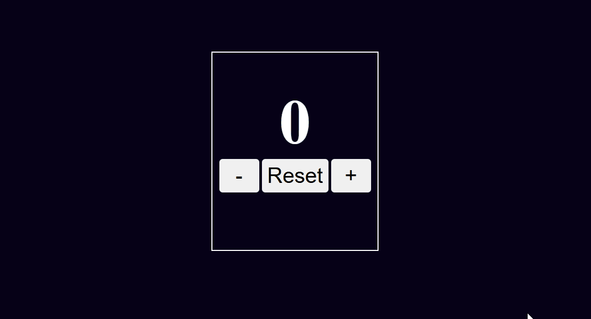

# Counter App

A simple and responsive counter application built with HTML, CSS, and JavaScript.

## 📸 Preview



---

## ✨ Features

- Increment counter
- Decrement counter
- Reset counter
- Responsive design

---

## 🛠️ Technologies Used

- HTML5
- CSS3
- JavaScript (ES6)

---

## 📂 Project Structure

```
01-counter-app/
├── index.html
├── style.css
├── script.js
├── README.md
└── assets/
        |--icons
        |--images

---

## 🚀 Getting Started

1. Clone the repository.
2. Open the `01-counter-app` folder.
3. Run `index.html` in your browser.

---

## 📚 What I Learned

- DOM manipulation
- Event listeners
- Updating UI dynamically
- Organizing JavaScript code

---

## 🔮 Future Improvements

- Local storage support
- Keyboard shortcuts
- Dark mode
- Animation effects