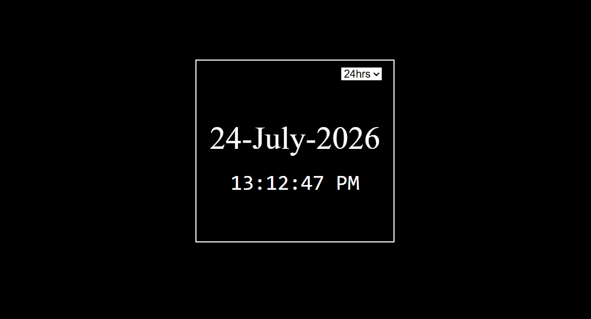

# ⏰ Digital Clock

A simple and responsive Digital Clock built using **HTML**, **CSS**, and **JavaScript**. The clock displays the current time and date with support for both **12-hour** and **24-hour** formats.

## 📸 Preview



---

## 🚀 Features

- ⏱ Live digital clock
- 📅 Displays current date
- 🔄 Switch between 12-hour and 24-hour formats
- 🌙 Automatic AM/PM indicator (12-hour mode)
- 🗓 Month displayed by name
- ⚡ Updates every second
- 📱 Simple and responsive layout

---

## 🛠 Technologies Used

- HTML5
- CSS3
- JavaScript (ES6)

---

## 📂 Project Structure

```
Digital-Clock/
│
├── assets/
│   └── images
|     |__clock_preview.gif
│
├── src/
│   ├── style.css
│   └── script.js
│
├── index.html
└── README.md
```

---

## 🧠 Concepts Practiced

During this project I learned and practiced:

- DOM Manipulation
- Event Listeners
- JavaScript Functions
- Helper Functions
- JavaScript Date Object
- Arrays
- Conditional Statements
- Template Literals
- `setInterval()`
- String Formatting with `padStart()`
- Updating the DOM Dynamically
- Basic Code Organization

---

## 🎯 Challenges Faced

While building this project, I encountered and solved several problems:

- Refactored repeated formatting logic into a reusable helper function.
- Fixed edge cases for 12-hour time (midnight).
- Implemented switching between 12-hour and 24-hour formats.
- Ensured the displayed date updates automatically at midnight.
- Improved code readability by separating the application into helper functions and update functions.

---

## ⚙️ How to Run

1. Clone the repository

```bash
git clone https://github.com/VikramGond/digital-clock.git
```

2. Open the project folder.

3. Open `index.html` in your browser.

No installation or additional packages are required.

---

## 💡 Future Improvements

- 🌗 Dark / Light Mode
- 🌍 Time Zone Support
- ⏸ Pause / Resume Clock
- 🎨 Theme Customization
- 📱 Improved Responsive Design
- 🌐 Display Day of the Week

---

## 📚 What I Learned

This project helped me understand how to:

- Work with the JavaScript `Date` object
- Update HTML elements dynamically
- Handle user input using event listeners
- Write reusable helper functions
- Organize JavaScript code into logical sections
- Build a real-time application using `setInterval()`

---

## 👨‍💻 Author

**Your Name**

GitHub: https://github.com/VikramGond

---

⭐ If you like this project, consider giving it a star!